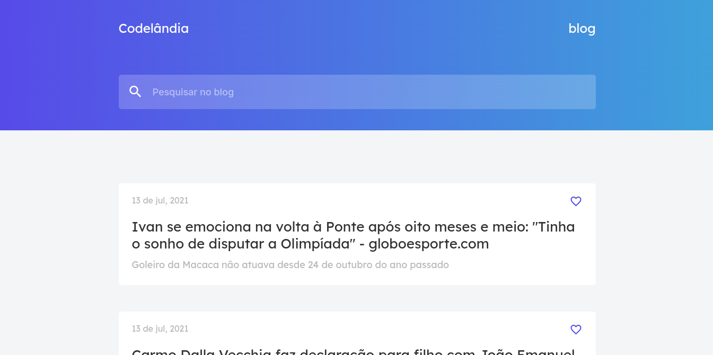
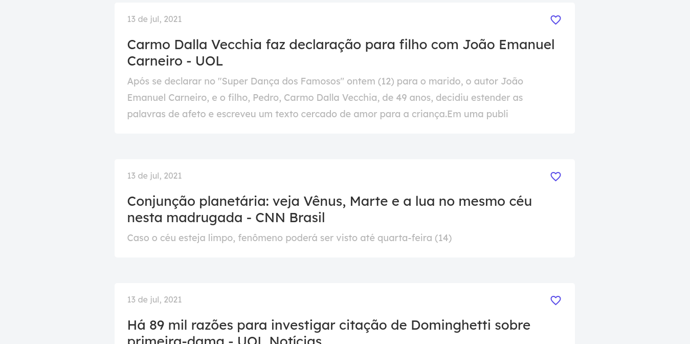

<h4 align="center"> 
	Desafio 01 - Codelândia 
</h4>
 
<p align="center">
  
  
  
  
  <a href="https://www.linkedin.com/in/paulobeckman/">
    
  </a>
	
  
  <a href="https://github.com/paulobeckman/Codelandia-News/commits/master">
    
  </a>

  
   <a href="https://github.com/paulobeckman/Codelandia-News/stargazers">
    
  </a>
</p>


## 💻 Sobre o projeto
Esse projeto é um desafio da comunidade do discorde Codelândia do [Iuri Silva][iuri]

Desenvolvi o desafio de acordo como pedido e fui além e implementei um conexão com api para mostrar noticias reais.

A Codelândia News - é uma landing page de noticias que mostra as manchetes de notícias e blogs da web utilizando a api da [newsapi][np]. Além disso, a pagina conta com animações da [ScrollrevealJS][bJS]  presentes em cada card de noticia.

As noticias são apresentadas em cartões contendo data da postagem, titulo e descrição.

## 🎨 Layout

O layout da aplicação está disponível no Figma:

<a href="https://www.figma.com/file/Yb9IBH56g7T1hdIyZ3BMNO/Codel%C3%A2ndia---Desafios?node-id=0%3A1">
  
</a>


### Web

<p align="center" style="display: flex; align-items: flex-start; justify-content: center;">
	
  	
		
  

  
</p>

## 🛠 Tecnologias

As seguintes ferramentas foram usadas na construção do projeto:

- [Node.js][nodejs]
- [CSS][css]
- [HTML][HTML]
- [JavaScript][JavaScript]
- [Nunjucks][Nunjucks]
- [News Api][np]
- [ScrollrevealJS][bJS]


## 🚀 Como rodar este projeto

### Pré-requisitos

Antes de começar, você vai precisar ter instalado em sua máquina as seguintes ferramentas:
[Git](https://git-scm.com), [Node.js][nodejs]. 
Além disto é bom ter um editor para trabalhar com o código como [VSCode][vscode]

### 🎲 Rodando o Back End (servidor) e a aplicação web (Front End)

```bash
# Clone este repositório
$ git clone https://github.com/paulobeckman/Codelandia-News.git

# Acesse a pasta do projeto no terminal/cmd
$ cd Codelandia-News

# Instale as dependências
$ npm install

# Execute a aplicação em modo de desenvolvimento
$ npm start

# O servidor inciará na porta:3000 - acesse http://localhost:3000 
```


## 📝 Licença

Este projeto esta sobe a licença MIT. Veja a [LICENÇA](license) para saber mais.

Feito por Paulo Beckman 👋🏽 [Entre em contato!](https://www.linkedin.com/in/paulobeckman/)

[nodejs]: https://nodejs.org/
[npm]: https://www.npmjs.com/
[vscode]: https://code.visualstudio.com/
[vceditconfig]: https://marketplace.visualstudio.com/items?itemName=EditorConfig.EditorConfig
[license]: https://opensource.org/licenses/MIT
[vceslint]: https://marketplace.visualstudio.com/items?itemName=dbaeumer.vscode-eslint
[prettier]: https://marketplace.visualstudio.com/items?itemName=esbenp.prettier-vscode
[CSS]: https://developer.mozilla.org/pt-BR/docs/Web/CSS
[HTML]: https://developer.mozilla.org/pt-BR/docs/Web/HTML
[JavaScript]: https://developer.mozilla.org/pt-BR/docs/Aprender/JavaScript
[Nunjucks]: https://www.npmjs.com/package/nunjucks
[np]: https://newsapi.org/
[iuri]: https://github.com/iuricode
[bJS]: https://scrollrevealjs.org/